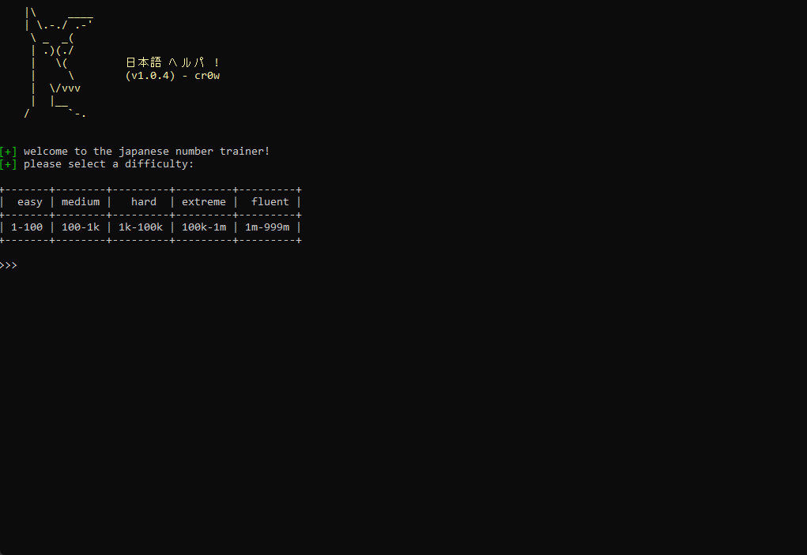

### `nihongo numbers`
I started learning Japanese and wanted to create a program that would help me test my ability to write numbers in Japanese! I hope this can be useful to you.

### `installation`
```
git clone https://github.com/cr-0w/nihongo-numbers.git && cd nihongo-numbers/
pip3 install -r requirements.txt
```

### `usage`
```
python3 nihongo-numbers.py 
```

### `demo`
Assume that we're given a number like `8`, we can enter in the number in a multitude of different ways. 
<br> In `hiragana (はち)`, `kanji (八)`, or in `romanji (hachi)`.



### `changelog`
---
- `v1.0.1` (fixed a bug that broke the program if you supplied the diff. in all caps)
- `v1.0.2` (reworked the difficulty options)
